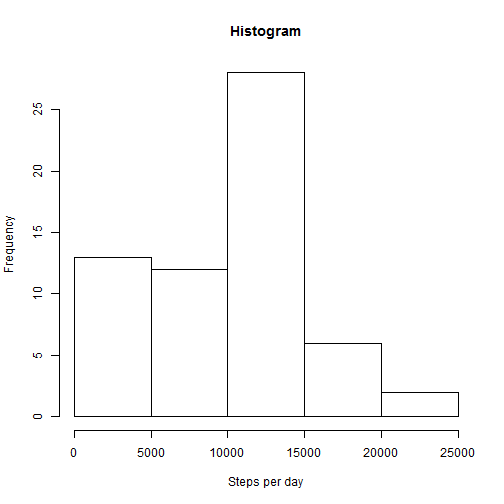
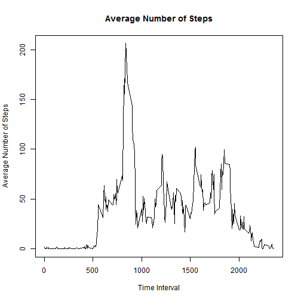
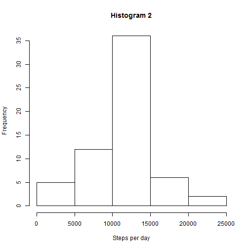
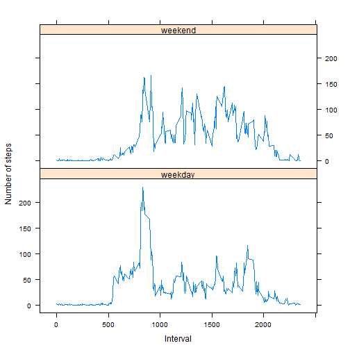

Reproducible Research: Peer Assessment 1
=========================================


## Loading and preprocessing the data

First, we load the data file, assuming it's already downloaded into the working 
directory


```r
data <- read.csv("activity.csv")
```

We then preprocess the data frame so that the date column is of date type


```r
data$date <- as.Date(data$date,"%Y-%m-%d")
```


## What is mean total number of steps taken per day?

Here is a histogram of the total number of steps per day


```r
stepsPerDay <- tapply(data$steps,data$date,sum,na.rm = TRUE)
hist(stepsPerDay, xlab = "Steps per day", main="Histogram")
```

 

The mean and median steps per day are 


```r
mean(stepsPerDay,na.rm = TRUE)
```

```
## [1] 9354.23
```

```r
median(stepsPerDay, na.rm = TRUE)
```

```
## [1] 10395
```

## What is the average daily activity pattern?
Now we plot the time series of the average number of steps taken in every
interval, averaged accross all days


```r
avgStepsPerInterval <- tapply(data$steps,data$interval,mean,na.rm = TRUE)
interval <- unique(data$interval)
plot(interval, avgStepsPerInterval, type = 'l',xlab = "Time Interval", 
     ylab = "Average Number of Steps",main = "Average Number of Steps")
```

 

The time interval with maximum average number of steps (most active time in day)


```r
interval[which.max(avgStepsPerInterval)]
```

```
## [1] 835
```

## Imputing missing values

Calculate the number of rows with missing data


```r
sum(is.na(data$steps))
```

```
## [1] 2304
```

Fill in the NAs with the mean for that interval


```r
data2 <- data
NAidxs <- is.na(data$steps);
avgStepsPerIntervalRep <- rep(avgStepsPerInterval,times = 61) #number of days
data2$steps[NAidxs] <- avgStepsPerIntervalRep[NAidxs]
```

Histogram of the total number of steps per day


```r
stepsPerDay2 <- tapply(data2$steps,data2$date,sum)
hist(stepsPerDay2, xlab = "Steps per day", main="Histogram 2")
```

 

The mean and median steps per day are 


```r
mean(stepsPerDay2)
```

```
## [1] 10766.19
```

```r
median(stepsPerDay2)
```

```
## [1] 10766.19
```
The values are different from the first part. Both the mean and the median are 
increased. One way to see this is from the difference in histogram where 
frequency of smaller number of steps per day is smaller.

## Are there differences in activity patterns between weekdays and weekends?


```r
data2 <- data.frame(data2,dayName = weekdays(data2$date))
weekend  <- data2$day == "Saturday" | data2$day == "Sunday"
day <- factor(weekend,labels = c("weekday","weekend"))
data2 <- data.frame(data2, day = day)
```
Note: In the above code chunk, we created new data frames since data size is not
very large. This can be inefficient for larger data sets

We now make a panel plot


```r
# First get the averages per interval grouped by day type
avgs  <- tapply(data2$steps,list(data2$interval,data2$day),mean)
f <- factor(c(rep(1,times=288),rep(2,times=288)), labels = c("weekday",
                                                             "weekend"))
# Create a new data frame with three columns: interval, average, day type
data3 <- data.frame(interval = c(interval,interval), avg = c(avgs[,1],avgs[,2]), 
                    day = f)
library(lattice)
xyplot(avg~interval | day, data = data3, layout = c(1,2),xlab = "Interval", ylab =  "Number of steps", type = "l")
```

 
